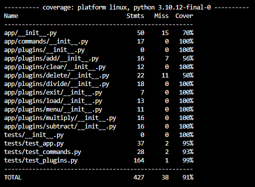

# Midterm - Calculator

# Introduction

Implemented a REPL and directly interactable calculator. This interface supports the following

-> Execution of arithmetic operations (Add, Subtract, Multiply, and Divide)
-> Management of calculation history.
-> Access to extended functionalities through dynamically loaded plugins.

# Setup

## Setup Instructions
1. Clone the repo
2. CD into the project folder
3. Create the virtual environment
4. Activate the virtual environment (VE)
5. Install Requirements

## Test Commands
pytest run all tests
pytest --pylint --cov <- Run Pylint and Coverage (Can be run independently)

# Usage

## Functionlity

### Calculator Operations:

Basic arthmetic operations like add, subtract, multiply and divide can be performed. With the help of the plugin architechture and dynamic loading design, we can add new feature dynamically in th eplugins folder without any hardcoding.

commands for the specific operation:

add - Addition
subtract - Subtraction
multiply - Multiplication
divide - Division
menu - Shows the list of commands
exit - Exit the application

menu command is to show all the available commands and will append the list if any new plugin is added in future. The plugin names are parsed directly to show the list.

### History Management:

Effective data management methods are employed to handle the data.

commands to handle the data:

load - Loads the history of operations performed
clear - Clears the history
delete - Deletes only specified index data 

history.csv containas the history of operations. The system effectively reads and writes the CSV file.

### Configuration via Environment Variables:

The application configuration details, development and testing environment variables are stored in .env file.

### REPL Interface:

This application works on the Read-Evaluate-Print-Loop pattern.

## Design Patterns

### Implementation and Application:

This applications used and implemented various design patterns. *Facade pattern* was used for the Pandas data manipulation. Command pattern is the REPL structure the application has and application's code structure is flexible and scalable using *Factory Method*, *Singleton*, and *Strategy Patterns*.

## Testing and Code Quality

### Comprehensive tests using pytest:

The test cases are in the folder tests. Majorly used unit testing and assertions to check all possible outcomes. These test cases helped to incres the application robustness.

pytest run all tests
pytest --pylint --cov <- Run Pylint and Coverage (Can be run independently)

test coverage = 91%

## Version Control, Documentation, and Logging

### Commit History:

This repo has kept a sequential and informative commit history for any reference

### Logging Practices:

Dynamic logging configuration through environment variables is performed. Professional logging system is designed and logs will contain all the critical steps while performing any operation. Detailed application operations, data manipulations, errors, and informational messages are provided using Logging. This system also retrieve and displays errors and handles exceptions without crashing the applications. Logging is majorly used in this application than print statements.
